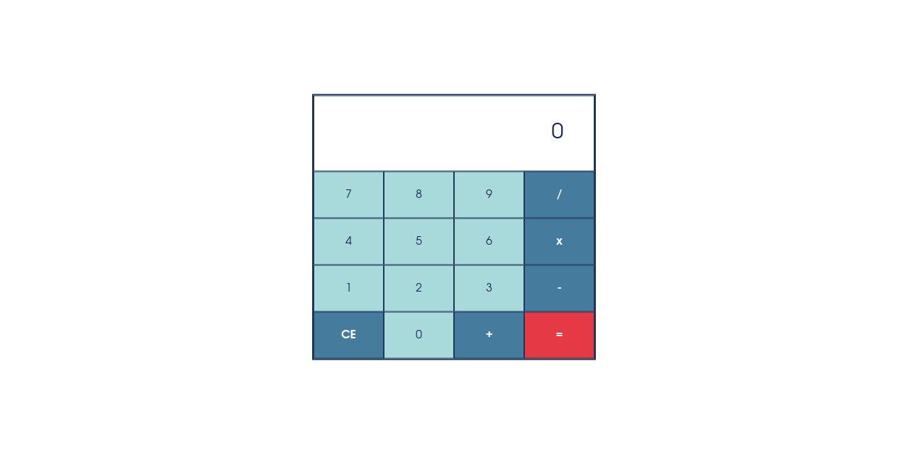

# My Simple Calculator

## What technology is used in this calculator?
- HTML5
- CSS3
- Bootstrap 5
- JavaScript

## What can this calculator do?
Well, this calculator is can do same thing as normal calculator.

## What's the lack of this calculator?
Based on normal calculator, this calculator is can't do:
- this calculator is hasn't been able to give plus-minus (+/-) to a number that will be operated.
- this calculator is hasn't save the history of the calculation.